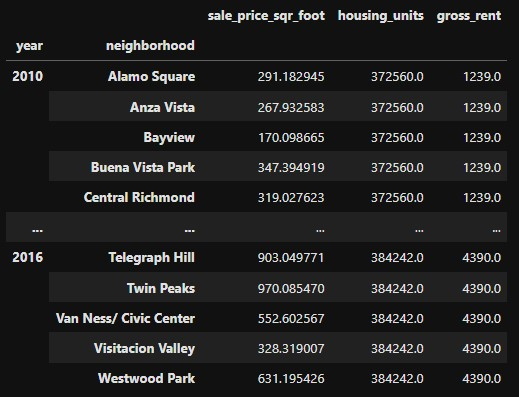

# Housing Rental Analysis for San Francisco

## Overview and Purpose
This project uses interactive charts and maps to analyze changes in the San Francisco real estate market between 2012 and 2016. The analysis will be performed within the context of the following scenario:

>Assume that you’re an analyst at a proptech company that wants to offer an instant, one-click service for people to buy properties and then rent them. The company wants to have a trial of this offering in the San Francisco real-estate market. If the service proves popular, they can then expand to other markets. Your job is to use your data visualization skills, including aggregation, interactive visualizations, and geospatial analysis, to find properties in the San Francisco market that are viable investment opportunities.

The purpose of this project is to demonstrate usage of Pandas, Holoviews, and Bokeh for data aggregation, interactive visualization, and analysis. It is the weekly challenge for Module 6 of the UW Fintech Boot Camp, Data Visualization with PyViz.

Click [here](https://nbviewer.org/github/lydiaciummo/sf-rental-market-analysis/blob/main/san_francisco_housing.ipynb) to view this notebook in a browser tab. This will allow you to view the full code and dataframes for the project without cloning the repository. Unfortunately, [Jupyter Notebook Viewer](https://nbviewer.org/) does not support holoviews, so the visualizations will not be shown.

---

## Initial Calculations and Visualizations
This project uses data imported from a CSV file containing pricing information from different neighborhoods in San Francisco. The two areas of interest for this project in particular were gross rent price and average sale price per square foot. The first section uses data aggregation along with line and bar charts to answer the following questions:
* What is the overall trend in housing_units over the period being analyzed?
* What is the lowest gross rent reported for the years included in the DataFrame?
* Did any year experience a drop in the average sale price per square foot compared to the previous year?
* If so, did the gross rent increase or decrease during that year?

To answer these questions, I aggregated the data by year and averaged the results. This gives us a rough estimate of pricing trends across the various neighborhoods.

```
prices_square_foot_by_year = sfo_data_df.groupby('year').mean()
prices_square_foot_by_year.sort_values('gross_rent')
```


## Comparing Neighborhoods
The second section focuses on the differences in pricing trends among the different neighborhoods in the city. In the context of the scenario proposed at the beginning of the project, I was particularly interested in the relationship between sale price per square foot and average gross rent price for each neighborhood.

To analyze this relationship I created a dataframe by aggregating the data by neighborhood and year, then visualized this data with a line chart and neighborhood map.

```
prices_by_year_by_neighborhood = sfo_data_df.groupby(['year','neighborhood']).mean()
prices_by_year_by_neighborhood
```



For the line chart I added an interactive widget to allow the viewer to select different neighborhoods from a dropdown menu:

```
prices_by_year_by_neighborhood.hvplot.line(
    x='year',
    xlabel='Year',
    ylabel='Avg. Sale Price/Sqft, Avg. Gross Rent',
    groupby='neighborhood',
    title='Average Sale Price per Square Foot and Average Gross Rent - By Neighborhood'
)
```


For the neighborhood map, I used the aggregated data per neighborhood averaged across all of the years in the dataset. The size of the points on the map represents the average sale price per square foot, while the color represents the average gross rent.

```
all_neighborhoods_df.hvplot.points(
    'Lon',
    'Lat',
    geo=True,
    size='sale_price_sqr_foot',
    color='gross_rent',
    frame_width=700,
    frame_height=500,
    tiles='OSM',
    title='San Francisco Avg. Gross Rent, Avg. Sale Price by Square Foot - 2012-2016',
    fill_alpha=.6,
)
```


## Final Questions and Conclusion
To conclude this project, I was asked the following questions:

### How does the trend in rental income growth compare to the trend in sales prices? Does this same trend hold true for all the neighborhoods across San Francisco?
The data provided for this analysis indicates that, fairly consistently across all of the neighborhoods surveyed, the average gross rental price has dramatically increased, often by nearly 400%. The data for average sale price per square foot was less consistent, however. Although most neighborhoods saw a fairly significant upward trend in pricing, some seemed to stay the same or even decrease over time.

### What insights can you share with your company about the potential one-click, buy-and-rent strategy that they're pursuing? Do neighborhoods exist that you would suggest for investment, and why?
Given the trends that we can observe from this data, it appears that buying and renting out properties in San Francisco has the potential to be very lucrative. Certain neighborhoods, such as Silver Terrace, Hunters Point, and Bayview seem to offer particularly high opportunities for return given their very high average gross rent price and comparably low average sale price per square foot.

Unfortunately, the question of whether or not this would actually be a good investment strategy is much more complicated and, in my opinion, cannot be answered simply by looking at pricing data. Other factors must be considered in order to make this determination. I would advise investors to proceed with caution when deciding whether to make a purchase, taking into consideration factors such as property tax, rent control, and the possibility of a market downturn.

On the surface, the one-click, buy-and-rent strategy seems attractive, but it also brings up the question of how much responsibility the company will take for managing liability, such as ensuring that the properties listed on their marketplace are actually viable. For example, since the investor is seeking simplicity with the transaction, that implies that someone else will be handling the process of inspecting the building to ensure that it is fit for habitation. Will the company be responsible for that, or will it be partnering with a third party? The idea of handling such large transactions with one click also becomes particularly problematic when considering where the funds will actually be coming from. I don't think it is possible to employ a one click strategy when the buyer is taking out a loan, and in the case of a cash purchase, how will the company ensure that the buyer is not money laundering?

In conclusion, I think that the idea of a one-click, buy-and-rent real estate investing startup would make for a good sales pitch and would probably be able to generate enough interest to attract investors. However, I think this idea may be a bit too good to be true. When considering how to answer this question, I was reminded of the used car sales company Carvana. The idea - easily buy a car online and have it delivered to your door - seemed so great, but when buyers received their cars, they were unable to get them registered. While I don't think it's impossible, I see so much potential for liability and controversy in this strategy that I would not recommend it.

## Personal Thoughts
This project highlighted to me how powerful data can be, but also how it only tells a small part of the full story. The San Francisco real estate market has become one of the most contentious and hotly debated in the nation. The influx of outside investors rushing in to capitalize on the city's booming housing market has put intense pressure on long-time residents and transplants alike to generate enough income to afford their homes, which in many cases, particularly for the historically disenfranchised, is simply impossible. As a person interested in technology and finance, I found myself pondering my own values while attempting to answer the questions. On one hand, I do support the free market to a certain extent, but on the other, viewing housing -a finite resource that is becoming increasingly inaccessible in high-tech west coast cities- as simply a commodity to be bought and sold like a stock or bond, does not sit right with me. I don't know what the solution is, but this has highlighted to me that, as technology and data science becomes more and more advanced, I think we as human beings have a moral imperative to at least consider how our innovations will affect the lives of those less fortunate.

---

## Technologies
* Jupyter Lab and Jupyter Notebooks
* Python 3.9
* Python packages: Pandas, Holoviews, Pathlib, Bokeh

---

## Contributors

Lydia Ciummo - lydiaciummo@hotmail.com

## Lincense

GNU General Public License v3.0